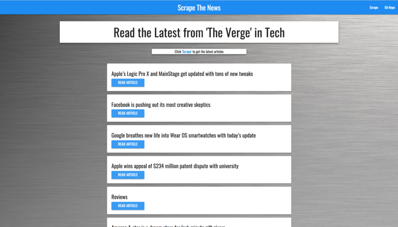
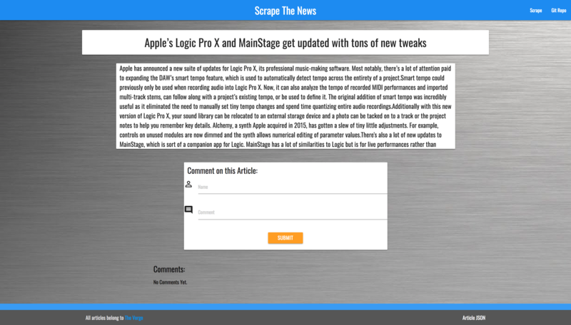

# Scraper

University of Denver Coding Bootcamp Week 18 - Scrape The News!

 ```
Welcome to Scrape the news! This app scrapes news articals from The Verge website, 
parses them and allows the user to leave a comment.
 ```

### As seen here.





### Built With

```
* MySQL
* Node.JS
* JavaScript
* Express-Handlebars
* Mongoose
* Body-parser
* Sequelize
* Cheerio
* Request

```

### Contributing

```
There are different ways to contribute
* Back End
* Designers
* Genius Idea's
* Unit Testers
* etc.
```

### Contributors

```
* Dennis Platts-Dethman
```

